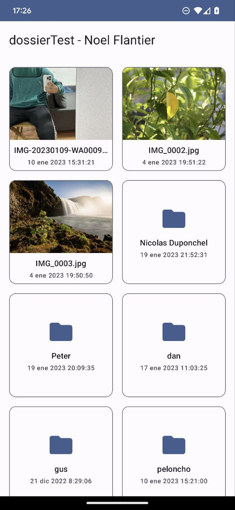
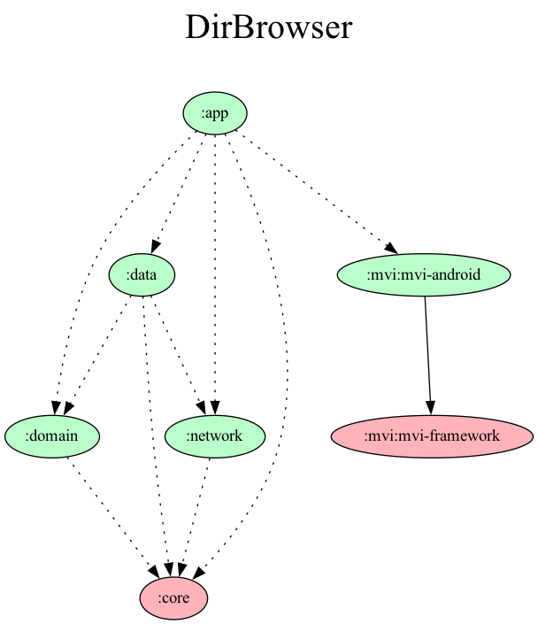

# DirBrowser
[](https://opensource.org/licenses/Apache-2.0)

>In order to make the app work, please add a `keys.properties` file in `[root]/network/` with the following content, replacing the variables with the appropiate data
```
BASE_URL=http://XXX.XXX.XXX.XXX:XXXX
AUTH_LOGIN={auth_username}
AUTH_PASSWORD={auth_password}
```

| List                                     | Favorites                                   |
|------------------------------------------|---------------------------------------------|
|  |  |

## Tech stack
- Clean Architecture approach
- MVI custom framework
- Material UI
    - CardView
    - RecyclerView
    - ConstraintLayout
- Kotlin
    - Coroutines
    - Flows
- Dependency Injection **(Dagger Hilt)**
- Http Client **(Retrofit)**
- Image Loading **(Picasso)**
- Unit  & UI Testing
    - JUnit4
    - Espresso
    - Mockk
    - Turbine
    - Fixtures

## Project Structure
***Modularization by layers.***



*Graph generated using the custom gradle task `projectDependencyGraph` that can be found in `config/tasks/custom-tasks.gradle`*

**App** module

> App module contains the logic and links all modules together. It is composed of two Activities
- **[BrowserActivity] :**
    - Contains all logic regarding downloading the User and showing the folders as the user is navigating through them.
    - The list of Items is composed by **BrowserListFragment**
- **[ImageViewerActivity] :**
    - Simple Activity that is only showing the Images in full screen mode.

**Domain** module
> The domain module contains the domain logic, which in this case is pretty simple, by encapsulating the usage of the Repository into usecases:
- `GetUserUsecase` returns the current logged in user
- `GetFolderUseCase` returns the list of items in a certain folder, passing the ID as parameter

**Data** module
> The data module contains and links all the data sources in the stack to provide the implementation for **Domain**'s repository. In this case, it communicates directly with the **Network** module to access the API and retrieve the list of Folders, and also has a simple **In memory cache** in order not to call multiple times when user is navigating.

**Satellite** modules
- ***Core*** module
    - > The core module contains the Classes that are shared amongst all modules. In this case the most important one is the `Result` one, which is the Result wrapper created in order to wrap *successful* and *error* calls.
- ***Network*** module
    - >The Network module is responsible of providing a way through dependencies to access the API. It also contains all the logic to transform a Network result into our core `Result`
- ***MVI*** framework modules
    - > The MVI framework module is composed by two modules:
    - ***Framework*** module, which holds the Kotlin pieces of MVI: Action, Actor, Reducer, Event and Effects
    - ***Android implementation*** module, which uses a ViewModel to bring all the pieces together using `Kotlin Flow`.